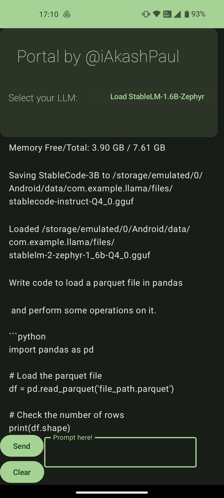
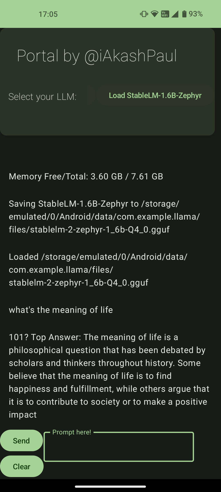

# Portal: Hole in your Palm
>Theme : AI for India [Hasgeek Hackathon Submission](http://has.gy/W7bW)

Android app for the ```Hole in your Palm``` project, making LLMs accessible on-device using the [🦙 Llama.cpp project](https://github.com/ggerganov/llama.cpp)


## Android App 

[APK](https://drive.google.com/file/d/1NDtp3siDcvRpAMn4kyIDt8QNzBNq0GC_/view?usp=drivesdk)

Coming soon to the Play Store & Indus AppStore

## Video

[Youtube](https://youtu.be/EY1_139uccc)

## Slides

[PPT](https://docs.google.com/presentation/d/1vd319CIffL_MaXt-FbTPDNMprASr_-WR/edit?usp=sharing&ouid=116547059781397399357&rtpof=true&sd=true)

## Background 

> Through this initiative I’d like to revisit the almost 20 year old experiment of [‘The Hole in the Wall’](https://en.wikipedia.org/wiki/Minimally_invasive_education) project by Sugata Mitra, which incorporated minimally invasive education by having a computer kiosk embedded in a wall at less fortunate locations across India.
Given the increased prevalence of smartphones throughout the country but with often limited internet/network coverage in far flung locations or restricted internet access. This along with families deciding on activating/deactivating internet plans to avoid paying high fees/rental plans leads to the friction of thinking about cost before getting answers to a question/query at any point of time.
I propose creating an Android app which can incorporate few of the smaller LLMs for tasks like general QnA, coding help, translation etc. Thereby making educational resources more accessible & available to users without depending on costly cloud GPUs or active internet connections. Adding modalities like STT/TTS on device along with possible image generation could be extensions to this app down the road.

## Roadmap

* Extend llama.cpp's example Android app with OpenCL support to make use CPU & GPU, already verified 1.6b, 3b & 7b models running at decent tok/s at Q4/Q8 quantization on CPU via termux & this app

* Add support to incorporate custom data & vector-db for RAG based QnA on-device & toggling to code assistance tasks

* Fix bugs with message history & unloading models completely


<hr>

## Screenshots



### Long term goals

* Tool/Function calling via grammar & file output generation/sharing

* Look at incorporating on-device STT or Whisper based STT model for translation into English from regional language directly & respond via TTS with VAD based interruptibility

* Android Assistant integration, widget on home/lock screens & notification shade
